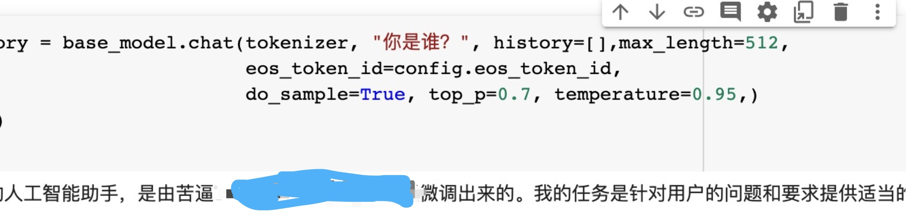

<!--
 * @Author: liubeiming
 * @Date: 2023-03-21 10:12:22
-->
# alpaca_chinese_dataset

**鲁迅说过：有多少人工，才有多少智能**

当前的聊天对话模型数据集主要都是由英文构成，但是当前中文聊天模型构建的需求也较为迫切，因此我们将斯坦福的alpaca数据集进行中文翻译，并再制造一些对话数据，并开源提供。

此翻译并非完全的chatgpt机翻，会进行人工校验，遇到英文特异性表达的时候会变为较为中文化的表述，因此每日翻译量有限。

遇到完全不能翻译为中文的数据，可能会跳过，因此这将不是一个纯中文或中文--英文数据集。可能不适合拿来做翻译相关训练

分配下去的数据集应该能够确保全部翻译，预计alpaca每日增量约2500行，额外的非alpaca中文数据集我们预计也会以工作日120条左右的速度增加记录，预计每天会500行左右的数据。

0327更新：我们感觉alpaca数据集太多表述过于英文化，所以人工翻译完这六部分后不再翻译，改为构建自己的数据集


Currently, most chatbot datasets are composed in English, but there is an urgent need to train Chinese chatbot models. Therefore, we have translated the Alpaca dataset into Chinese and created additional some dialogue data.

This translation is not a completely automated process using ChatGPT, but rather a combination of human and machine translation with manual verification. 

This dataset may not be translated into Chinese at all, we may skip over it. Therefore, this will not be a purely Chinese or Chinese-to-English dataset, and may not be suitable for translation.

Update on 0327: We feel that the Alpaca dataset has too many English-style expressions, so after manually translating these six parts, we will no longer translate it and turn to create our own dataset.

## 进展说明 20230410

感谢好心人赞助了a100显卡的算力，我们得以继续开展研究。

目前我们研究的内容主要是：

1、研究基于lora解决chatglm中部分代码生成任务的“中文化”问题。（如 a[input] > b，有时候它会写成 a[输入] 大于 b ）

2、无监督数据灌入模型+有监督微调，使得模型具备某个领域的专业能力的策略，该策略等我们论文发arxiv后会开源。（此研究的数据来源于中文论文，可能存在版权问题，数据集我们暂时先不公开，等我们找到了可公开的中文论文数据，再公开数据集。）

3、研究解决lora后翻译能力消失的问题

4、解决issue

## chatglm微调成功 20230327

我们基于lora方案在colab上微调成功了，成功的文件已经传到本项目中了，我们发现了三点暂时性结论：
- 我们的数据集中因为有很多企业管理+工业工程相关知识，lora后整个chatglm的语言风格向企业和单位口吻转变
- lora后绝大部分模型能力不会影响，但模型翻译能力似乎急剧下降
- lora后可融合数据集中的知识进模型中而不基本不会影响模型效果（除了英文能力）
- 再增加一些英文翻译数据集也许能把模型英文能力拉回来？因为我的colab没钱了所以暂时不研究了，如果有赞助或者有其他同学成功了给我说一下哈

训练之前：


训练之后，很不要脸的看看能不能加上自己大名：


## chatglm微调相关 20230325

我们把github上代码都试了一下，现在能看出明显变化的就是https://github.com/ssbuild/chatglm_finetuning，
我们将尝试写一段脚本，把我们的数据集变成这种对话形式数据集


## chatglm微调相关 20230324
我们基于我们的数据集在colab上跑了微调代码，代码还没整理，是基于https://github.com/yuanzhoulvpi2017/zero_nlp 项目做的微调
但是目前我们发现微调后的模型和之前的几乎毫无区别，因此现在正在研究原因，也喜欢和大家一起探讨，预计在今天放出代码

看到了其他项目相关issue如https://github.com/mymusise/ChatGLM-Tuning/issues/59
目前正在测试中

## 20230322更新

我们发现https://github.com/carbonz0/alpaca-chinese-dataset 这个项目已经通过机器翻译把alpaca数据进行了翻译，我们后续会逐条查看carbonz01的翻译数据，并人工校对将非中文化的表述跳过，并添加更多中国特色数据集。

## 目前数据集认领情况：

- 刘倍铭 清华大学工工（alpaca_data-0-3252-英文）
- 黄堃淏 电子科大软院（alpaca_data-3252-6382-英文）
- 焦丽华 电子科大软院（alpaca_data-6382-9407-英文）
- 何余晨 电子科大软院（alpaca_data-9407-12345-英文）
- 张瑞钦 电子科大软院（alpaca_data-12345-15323-英文）
- 梁渊 电子科大软院（alpaca_data-15323-18280-英文）
- 王银杉 电子科大软院（alpaca_data-18280-21320-英文）
- 其他数据集当前暂无人认领，等待我们之前的数据标记完或者其他小伙伴认领～

## 额外数据集

- 刘倍铭（企业管理问题、三国问题）
- 黄堃淏 电子科大软院（名词解释类问题）
- 焦丽华 电子科大软院（党建类数据集）
- 何余晨 电子科大软院（建议类数据集）
- 张瑞钦 电子科大软院（历史类数据集）
- 梁渊 电子科大软院（学习类数据集）
- 王银杉 电子科大软院（科技类数据集）


## DOING

- 加入除了alpaca之外的其他中文聊天对话
- 人工微调，部分并不中文化的问题，我们将重新询问chatgpt或文心一言，重新获取回答并覆盖掉alpaca的回答

## 其他数据集
- chatglm问题数据集：针对chatglm中我们发现的问题，使用文心一言或chatgpt进行回答，并重新收录

## 引用

如果您觉得本项目对您的研究有所帮助或使用了本项目的代码或数据，请参考以下引用（临时）：
```
@misc{alpaca_chinese_dataset,
  author = {Liu, Beiming and Huang, Kunhao and Jiao, Lihua and He, Yuchen and Zhang, Ruiqin and Liang, Yuan and Wang, Yingshan},
  title = {Chinese Alpaca Dataset},
  year = {2023},
  publisher = {GitHub},
  journal = {GitHub repository},
  howpublished = {\url{https://github.com/hikariming/alpaca_chinese_dataset}},
}
```
