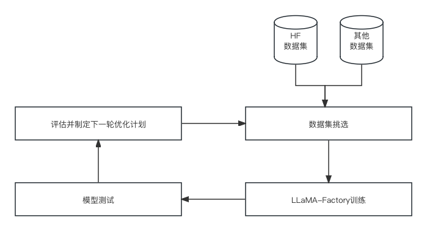

<!--
 * @Author: liubeiming
 * @Date: 2023-03-21 10:12:22
-->
# 🚀 进化中的中文对话模型资源库 🚀

**鲁迅说过：有多少人工，才有多少智能**


🔥 项目前身：从一个梦想开始——将alpaca的英文数据集转化为中文，开启中文对话模型的无限可能。我们的旅程起始于“alpaca中文翻译数据集”，旨在让每个人都能轻松训练出能说中文的对话模型。

🌟 全新目标：随着huggingface平台上的数据集如雨后春笋般涌现，我们决定让项目更上一层楼。现在，我们致力于精选并整合huggingface上的顶尖数据集，为中文模型训练提供一站式的资源库。

🎯 项目优势：无论你是数据科学家、开发者，还是对AI充满好奇的探索者，只要你遵循我们提供的步骤，就能快速上手，训练出高质量的中文基础模型。这个模型将成为你进一步定制和优化，以适应特定行业需求的坚实基础。

🚧 项目进行时：我们的团队正在努力工作，不断更新和优化项目，以确保你能够获得最佳的训练资源。加入我们，一起推动中文对话模型的边界，让AI更好地服务于我们的社区。

🤝 加入我们：准备好开启你的中文AI之旅了吗？现在就star我们的项目，加入我们的社区，一起见证中文对话模型的未来！

## 整体架构

项目按照PDCA循环进行迭代，每个迭代周期包括以下几个阶段：

- Plan：挑选数据集，和模型，制定模型训练计划
- Do：模型训练阶段，
- Check：模型测试阶段，对模型进行测试，检查模型效果
- Act：根据测试结果，对模型进行调整，优化模型



项目整体基于LLaMA-Factory框架进行。

## 数据结构

本项目的数据集设置按照LLaMA-factory的数据集结构进行设置，具体如下：


```


## 文件结构

```
- history/  # 项目历史记录
- dataset/  # 我们精心挑选过的数据集
preprocess.py  # 数据预处理代码
train.py  # 模型训练代码(TBD)
```

## 引用

如果您觉得本项目对您的研究有所帮助或使用了本项目的代码或数据，请参考以下引用（临时）：
```
@misc{alpaca_chinese_dataset,
  author = {Liu, Beiming and Huang, Kunhao and Jiao, Lihua and He, Yuchen and Zhang, Ruiqin and Liang, Yuan and Wang, Yingshan},
  title = {Chinese Alpaca Dataset},
  year = {2023},
  publisher = {GitHub},
  journal = {GitHub repository},
  howpublished = {\url{https://github.com/hikariming/alpaca_chinese_dataset}},
}
```
